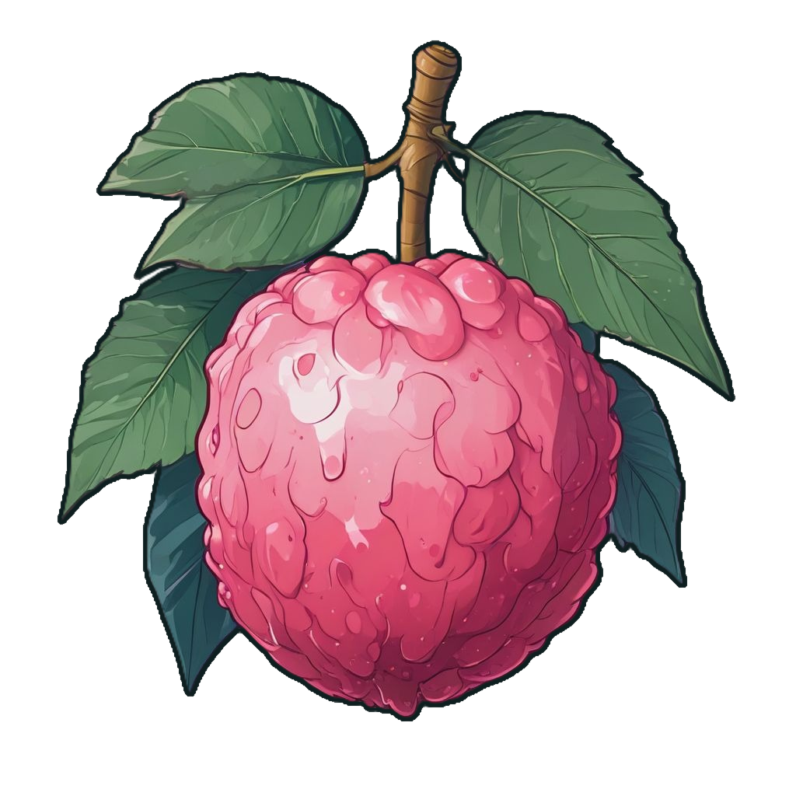

# Lychee

Lychee is a programming language I developed for fun. It is a statically typed language with a syntax similar to rust.
It compiles to a custom instruction set and runs in on a VM. The language is still in development and is not intended
for production use.

## Structure

This repository contains the compiler and the VM for the language, both written in rust.
